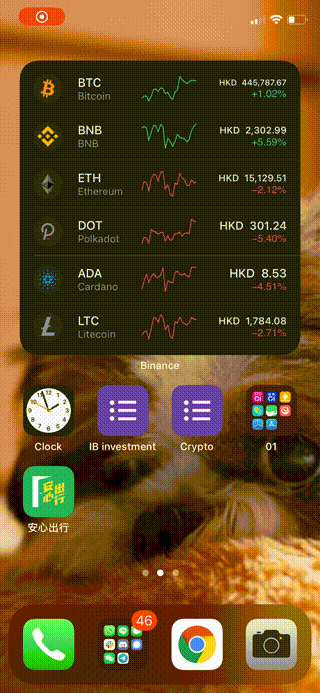

# iOS Hong Kong News widget with scriptable

## Requirements
- iOS 14+
- [Scriptable for iOS](https://apps.apple.com/de/app/scriptable/id1405459188)

## Credits
Inspired by [Saudumm's project](https://github.com/Saudumm/scriptable-News-Widget) which scraped WordPress and RSS Feeds. 

## Installation
1. Install the [Scriptable for iOS](https://apps.apple.com/de/app/scriptable/id1405459188)
2. Launch the `Scriptable` app.
3. Press the `+` from top right. 
4. Copy and Paste [hk-news-widget.js](hk-news-widget.js) 
5. Tap `Untitled Script` and change the name to `HK News Widget` then click `Done`
6. Back to home screen Tap and hold down on any blank area on your iPhone home screen until all the apps start wiggling, i.e. jiggle mode.
7. Tap on the + symbol
8. Search for `Scriptable`
9. Swipe to choose a widget size and tap `+` Add Widget
10. Choose `HK News Widget` for Script; `Open App` for When Interacting; `HK01` or `APPLEDAILY` for feed parameter. Add `,true` afte the feed parameter for showing thumbnail.
11. Done

You may repeat step 6-10 to add more HK News Widget. 

